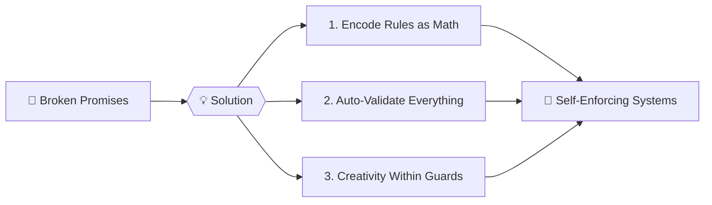
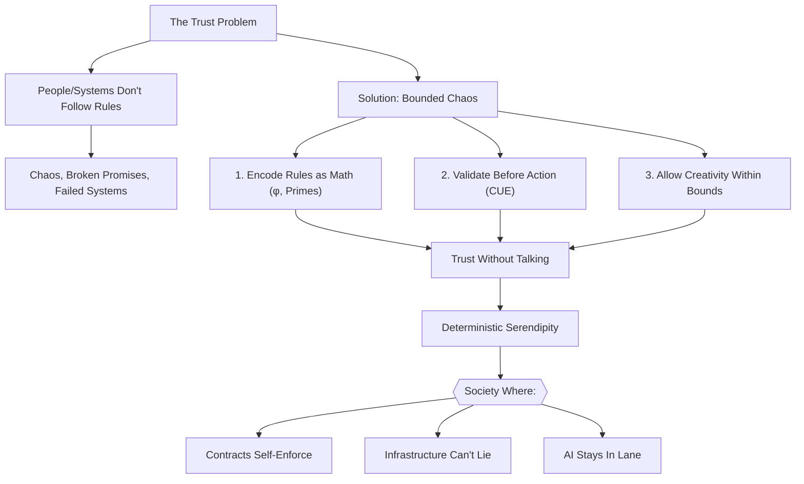
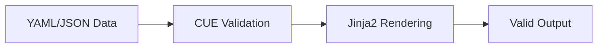

# 🏛️ Bounded Chaos: The Trust Engine  
*"Finally, rules that can't be bent or broken"*  



## 🚨 The Pain  
- **Business**: Contracts ignored without consequences  
- **Tech**: "Works on my machine" disasters  
- **Government**: Policies never implemented as written  
- **AI**: Hallucinations breaking reality checks  

## 🎯 The Fix  
We built **digital physics** where:  
- Rules are baked into systems like gravity  
- Validation happens *before* mistakes occur  
- Everything gets a "spell-check for truth"  

## 🌟 Why It Works  
| Before | After |
|--------|-------|
| 🤷 "Trust me" | 🔒 "Here's the math proof" |
| 🕵️ Manual audits | 🤖 Instant validation |
| 💔 Broken promises | ✅ Predictable outcomes |

## 🚀 Get Started  
```bash
# Try it in 60 seconds
##git clone https://github.com/bounded-chaos/demo ### not yet
cd demo && ./trust-but-verify.sh
```

> *"Like traffic lights for civilization – invisible until someone tries to run a red."*  

📰 **Featured Use Cases**:  
- 🔐 Self-enforcing contracts  
- 🤖 AI that stays in bounds  
- 🏛️ Laws that execute as written  

📅 *Est. 2025 Cebu | Arch Linux Approved | No Blockchains Harmed*




