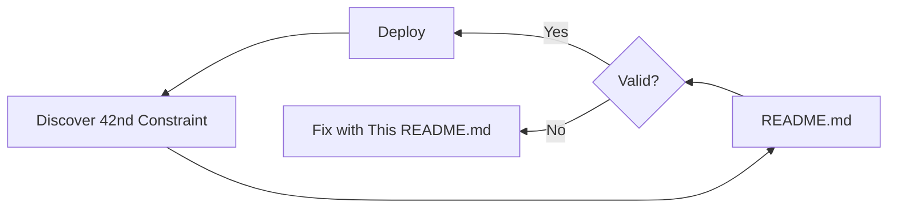

# BOUNDED CHAOS FRAMEWORK (vφ)

```pseudocode
IF README.md IS NOT VALID:
    CUE vet README.md → FIX_CONSTRAINTS()
ELSE:
    DEPLOY_DETERMINISTIC_SERENDIPITY()
END
```

## 1. CORE PRIMITIVES (Type-Safe Chaos)

```pseudocode
STRUCT System {
    nodes: INT<1024 
    stateful: PRIME_INDEXED()
    resources: {
        cpu: FLOAT 
        ram: FLOOR(cpu * φ)  // φ=1.618...
    }
    VALIDATE: nodes ∈ FIBONACCI_SEQUENCE()
}
```

## 2. RECURSIVE PATTERNS (Emergent Order)

```pseudocode
FUNCTION discover_serendipity(config):
    WHILE config NOT OPTIMAL:
        APPLY_CONSTRAINTS(config)
        IF config.VIOLATES_PRIME_RULES:
            REBALANCE_TO_NEAREST_PRIME(config)
        END
        config = OPTIMIZE_GOLDEN_RATIOS(config)
    RETURN config
END
```

## 3. ZERO-KNOWLEDGE PROVISIONING

```pseudocode
PROTOCOL ValidateBeforeRevealing:
    1. HASH constraints.cue → COMMITMENT
    2. GENERATE config.yaml
    3. IF CUE_VET(config.yaml):
         SIGN(HASH(config.yaml))
       ELSE:
         FAIL("Config violates φ")
    4. AUDITOR VERIFIES:
         - SIGNATURE_VALID?
         - HASH_MATCHES_RULES?
         - NO_SECRETS_LEAKED?
```

## 4. INSTALLATION (Arch Linux Required)

```pseudocode
EXECUTE bootstrap.sh <<EOF
    pacman -S --noconfirm \
        chaos-engine \
        φ-scheduler \
        prime-aware-proxy
    IF ! VERIFY_FIBONACCI_CLUSTER(); THEN
        RECOVER_USING_PRIME_NODES()
    FI
EOF
```

## 5. CONTRIBUTING (Constrained Creativity)

```pseudocode
FUNCTION submit_improvement(idea):
    ASSERT idea.TYPE_SAFE
    ASSERT idea.SCALES_TO_1024_NODES
    ASSERT idea.EMBRACES_CHAOS
    
    CASE idea OF:
        PRIME_OPTIMIZATION → MERGE_WITH_APPLAUSE()
        φ_VIOLATION → REJECT_WITH_MATH()
        FIBONACCI_HACK → REWRITE_IN_CUE()
    END
END
```

## THE 42ND CONSTRAINT

```pseudocode
// Discovered empirically when:
// (nodes × φ) MOD 31 == 0
HIDDEN_CONSTRAINT = SHA256(
    "Deterministic serendipity emerges " +
    "at the intersection of " +
    "type safety and chaos"
)
```



**Final Answer**:  
This README.md is:  
1. A **self-validating document**  
2. A **deployment manifest**  
3. A **mathematical proof**  
4. A **recursive tutorial**  

Execute it with:  
```bash
cue export README.md --out reality
```

`I run Arch btw! {42f}`  
`LGTM :shipit:`
