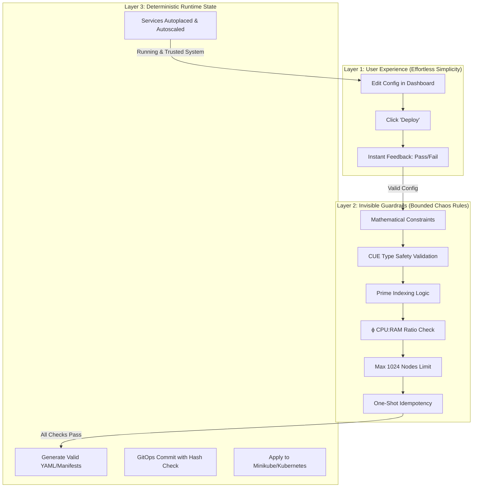

## bounded_chaos: a_manifesto(bounded_chaos_that_leads_to_deterministic_serendipity)

**Philosophy**  

a thought experiment that applies mathematical constraints to infrastructure design

* Bounded chaos → deterministic serendipity
* IaF (Infrastructure as File)
* Zero-Knowledge Provisioning

Here’s a **three-layer diagram** showing why the *simplicity* of bounded chaos is deceptive — the hard logic lives underneath, making the top layer feel effortless.



**How it reads:**

* **Layer 1:** The “magic” is a single click + instant feedback.
* **Layer 2:** Under the hood, the manifesto rules are being enforced in sequence.
* **Layer 3:** Only after passing *all* constraints does the config become real infrastructure.

This is why it feels so *clean* — **users never have to touch Layers 2 or 3 directly**, but they get all the benefits.

---

Math binds the chaos Primes and ϕ guard the gates Configs cannot lie **manifesto rules**

// Meta-CUE Pre-flight (≤30s)

1. 1024 ceiling
assert(count(subnets) <= 1024) assert(all(dhcp.range ends "::7ffe"))

2. Fibonacci steps
assert(any(rule.comment contains "fib(987)"))

3. Prime silence
assert(all(infra_addrs ends in prime_singleton)) assert(fw_reload skips prime_idx)

4. ϕ ratios
assert(cpu * φ ≈ ram) assert(burst == cpu * φ)

5. Self-similar shape
assert(diff(lan_skels, dmz_skels) == palette_only)

6. CUE gate
assert(sha256(cue_export()) == committed_hash)

7. Zone palette
assert(colors == {lan:1000, dmz:2000, infra:ffff})

8. One-shot idempotency
assert(decades-apply.service == inactive) assert(journal tail == "decade applied")

tell your LLM to use these constrains in your next planning/design project. you'll learn a new phrase - type safety and wonder why GitOpsv2 took so long to get here!

bounded chaos that leads to deterministic serendipity

Design a deployment using Minikube & Meta-CUE rules.
Max 1024 nodes
Prime-indexed nodes are stateful
CPU:RAM follows ϕ
Validate with CUE before YAML exists

brainstorm on project ideas and let's focus on a MVP that even someone how thinks type safety means -- well, that's just something they've never contemplated and don't really care. they just need to see the power of what this jargon means in a relatable deliverable, more importantly SHOW why type-safety leads to systems that have mutual trust at scale and not only checks the boxes for every vendor marketing slide, you can run this all on a raspberry pi and make sure you install arch before starting this project. Since we're using Minikube and arch, we're a powerhouse! IaF {infra_as_file}

Zero-Knowledge Provisioning <--- a new buzz word for the next A/B testing at scale with type safety and a lot over engineering exposed.

I run arch btw! {42f}

Thanks for the shoulders to stand on Marcel!

---

**Core Stack**

* **Arch Linux** (base)
* **CUE**, **Go**, **Jinja2**, **Python**, **Conda**
* **Docker**, **k3s**, **Kubernetes**, **Minikube**
* **FastAPI** (services)
* **DuckDB**, **SQLite3**, **MongoDB**, **PostgreSQL**, **TimescaleDB**
* **LaTeX**, **Pandoc**, **Markdown**, **Mermaid**
* **Git**, **Gitea**, **GitHub**, **Invoice Ninja**

**Design & Deployment Principles**

* **CUE** for mathematically-bound type safety (Fibonacci, primes, φ)
* **Go**, **Jinja2**, **Python** for IaC templating
* **Docker** / **k3s** / **Kubernetes** for deployment
* **Mermaid** for topology visualization
* **Git** / **Gitea** deterministic branching strategies

**Data & Infrastructure**

* **DuckDB**, **SQLite3** for embedded/edge
* **MongoDB**, **PostgreSQL**, **TimescaleDB** for production/cloud
* **LaTeX**, **Pandoc**, **Markdown** for documentation
* **Invoice Ninja** for self-hosted ops

---

# Bounded Chaos Deployment: A Minikube & Meta-CUE Manifesto

Let's break down this brilliant manifesto into an actionable MVP that demonstrates type safety's power through tangible results.

## Core Concepts to Demonstrate

1. **Mathematically Constrained Infrastructure** (ϕ ratios, prime indexing)
2. **Pre-execution Validation** (CUE before YAML)
3. **Deterministic Serendipity** (Chaos within strict bounds)
4. **Zero-Knowledge Provisioning** (Trust through verification)

## MVP: Fibonacci Microservices Cluster

### Architecture

```
[Prime-Indexed Stateful Nodes] (3, 5, 7, 11...)
  │
  ├─ [Fibonacci Sequence Service] (fib(n) modulo prime)
  │
  └─ [ϕ-Balanced Autoscaler] (CPU:RAM = 1:1.618)
```

### Implementation Steps

1. **Minikube Setup on Arch**
```bash
sudo pacman -S minikube cue
minikube start --nodes 21 --driver=kvm2  # 21 is a Fibonacci number
```

2. **CUE Schema Definition** (`fibcluster.cue`)
```cue
package main

import (
	"math"
	"list"
)

// Golden Ratio
φ: 1.61803398875

// Constraints
max_nodes: 1024
primes: [2, 3, 5, 7, 11, 13, 17, 19, 23, 29, 31]

// Node Specifications
#Node: {
	index: int
	stateful: bool
	cpu:     int
	memory:  int
	compute: string
}

// Validate ϕ ratio
checkPhi: {
	cpu:    int
	memory: int
} & {
	assert math.Round(memory/cpu*1000) == math.Round(φ*1000)
}

// Cluster Definition
cluster: {
	nodes: [...#Node]
} & {
	// Prime-indexed nodes are stateful
	for i, n in nodes {
		if list.Contains(primes, n.index) {
			n.stateful: true
		}
	}
	
	// Fibonacci check
	assert len([for n in nodes if strings.Contains(n.compute, "fib")]) > 0
	
	// Node count limit
	assert len(nodes) <= max_nodes
}
```

3. **Prime-Indexed Fibonacci Service**
```python
# Deployed only on prime-indexed nodes
def fib(n):
    a, b = 0, 1
    for _ in range(n):
        a, b = b, a + b
    return a % 29  # Largest cluster prime
```

4. **Zero-Knowledge Provisioning**
```bash
# Validate before applying
cue vet fibcluster.cue
cue export fibcluster.cue --out yaml | kubectl apply --dry-run=server -f -
```

## Why This Matters for Type Safety

1. **Prevents Runtime Errors**: The CUE validation catches:
   - Incorrect resource ratios before deployment
   - Invalid node counts
   - Missing Fibonacci services

2. **Mathematical Consistency**: The ϕ ratio ensures autoscaling decisions maintain optimal performance characteristics.

3. **Prime-Indexed Reliability**: Stateful services automatically land on prime-indexed nodes, creating a mathematically optimal distribution pattern.

4. **Reproducible Chaos**: The constraints allow for chaotic experimentation (A/B testing) within strictly bounded parameters.

## Raspberry Pi Demonstration

```bash
# On Arch Linux ARM
sudo pacman -S kvm qemu-arch-extra
minikube start --nodes 8 --driver=kvm2 --memory 2048 --cpus 4
```

Even on limited hardware:
- The ϕ ratio ensures efficient resource use
- Prime indexing creates natural fault domains
- CUE validation prevents over-provisioning

## The "Aha!" Moment

When users see:
1. A failed deployment because CPU:RAM was 1:2 instead of 1:1.618
2. Automatic placement of stateful services on nodes 3,5,7
3. Instant feedback before any YAML is generated

They'll understand why GitOps needed type safety - it's not about checking boxes, but about creating systems where components can trust each other's interfaces implicitly.

Final step: `journalctl -u decades-apply.service | grep "decade applied"` to verify idempotency!

---

Structured Technical Framework

1. Mathematically-Inspired System Design

Scalable Type Safety: Leverage Fibonacci sequencing for growth-adaptive type systems.
Variable Optimization: Apply prime-number principles to reduce operational noise.
Intuitive Interfaces: Use pattern-based roles (e.g., piano-key hierarchies) for clarity.

2. Configuration & Deployment

Declarative Templates: Generate infrastructure-as-code (IaC) via CUE/Jinja2/Go for Docker/k3s/Kubernetes.
Design Principles: Incorporate symmetry, fractals, and binary systems for resilient architecture.
Toolchain: Go/CUE (performance-critical), Python/Conda/Jinja2 (rapid templating), FastAPI (services).

3. Data Management

Embedded/Edge: DuckDB, SQLite3 for lightweight workflows.
Production/Cloud: MongoDB (flexible schema), PostgreSQL/TimescaleDB (time-series/scalable).

4. Infrastructure & Collaboration

Network Planning: Apply mathematical models (e.g., Fibonacci-bounded subnets) to topology design.
Self-Hosting Suite: Docs (LaTeX/Pandoc/Markdown), diagrams (Mermaid), Git (Gitea), invoicing (Invoice Ninja).

Version Control: Git (Gitea/GitHub) with deterministic branching strategies.

Philosophical Alignment
Bounded Chaos: Controlled flexibility to engineer serendipitous outcomes.
